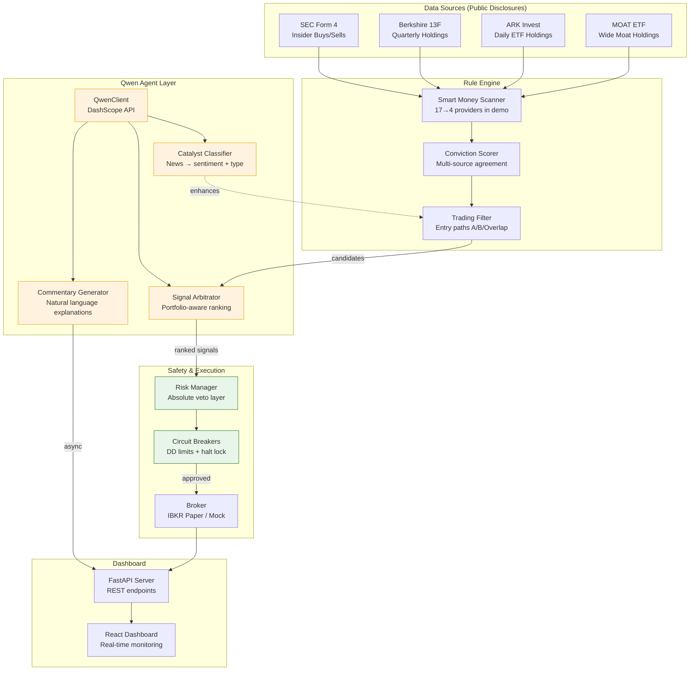
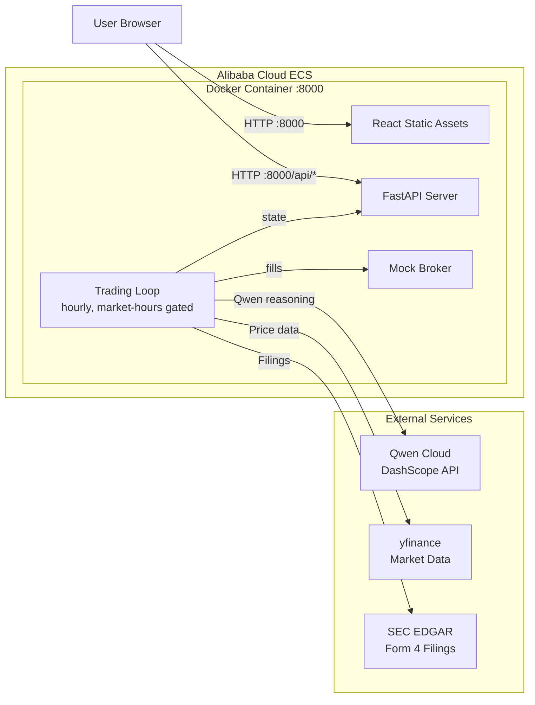

# Architecture Diagram

Use this Mermaid source to render the architecture diagram for submission.
Render at: https://mermaid.live/ or include directly in the README.

## System Overview



## Deployment Architecture



## Trading Cycle Sequence

```mermaid
sequenceDiagram
    participant Loop as Trading Loop (hourly)
    participant Scan as Smart Money Scanner
    participant Qwen as Qwen Cloud
    participant Risk as Risk Manager
    participant Broker as Broker/Mock

    Loop->>Scan: Fetch smart-money filings
    Scan-->>Loop: ranked candidates (conviction scored)

    Loop->>Qwen: Classify catalyst headlines
    Qwen-->>Loop: Enhanced classifications + confidence

    Loop->>Qwen: Rank candidates (portfolio context)
    Qwen-->>Loop: Prioritized action plan + reasoning

    Loop->>Risk: Validate signals (priority order)
    Risk-->>Loop: Approved / Rejected (with reasons)

    Loop->>Broker: Submit bracket orders (approved only)
    Broker-->>Loop: Fill confirmations

    Loop->>Qwen: Generate commentary (async, non-blocking)
    Qwen-->>Loop: Natural language cycle summary
```
